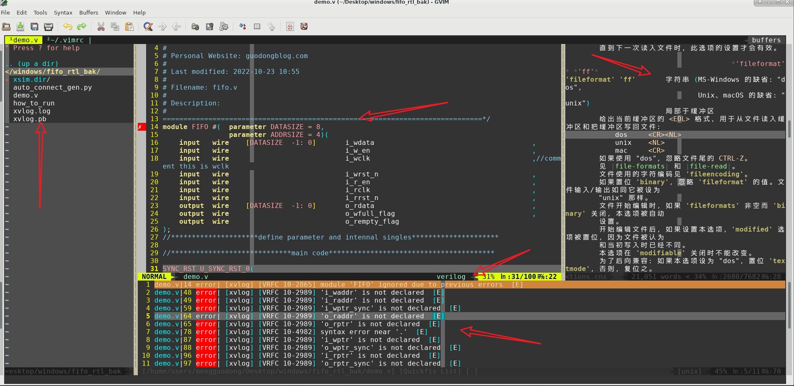
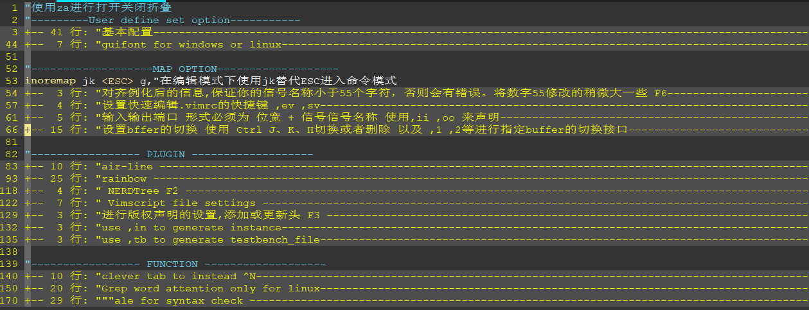
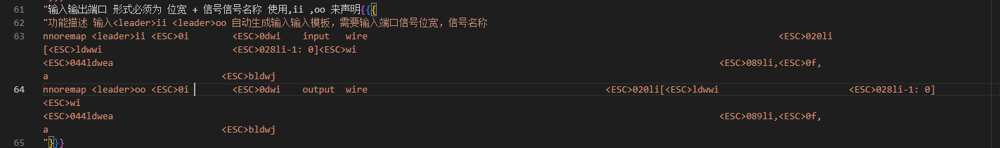
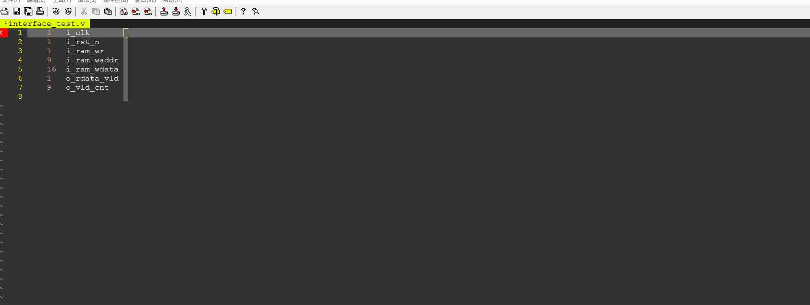
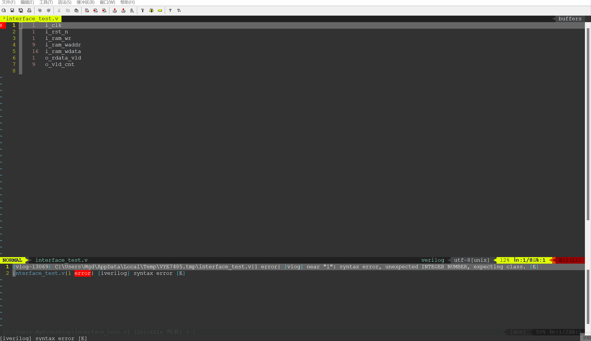

> gvim_for_verilog 仓库是用于分享适用于Verilog的VIM配置方案，重点在于简洁使用，开箱即用！！！有问题以及改进欢迎提PR，或者直接联系作者邮箱823300630@qq.com

>本文将详细描述将vim变成写Verilog代码的IDE客制化的实现过程，同时最后提供自己的环境。实现的过程中有使用自己写的，也有参考借鉴其他同学进行一定的修改，也有直接使用插件实现的相关功能。对应的功能实现部分均会给出相应的参考与插件地址等有关该功能的实现信息。有兴趣的同学可以据此，在此基础上实现适合自己的IDE工具。

> 都是慢慢抄，慢慢学，慢慢修改，千万记得自己总结，抄到的才是自己的~
# 目录<!-- omit in toc -->
- [概述](#概述)
  - [特性（Feature）](#特性feature)
  - [效果演示](#效果演示)
- [使用方式](#使用方式)
- [实现与演示](#实现与演示)
  - [基本的映射](#基本的映射)
  - [快速生成端口列表（input、output）](#快速生成端口列表inputoutput)
  - [插件的使用与推荐](#插件的使用与推荐)
  - [NERDTREE\[树形目录\]的安装与使用](#nerdtree树形目录的安装与使用)
    - [功能描述](#功能描述)
    - [演示](#演示)
    - [安装与配置](#安装与配置)
  - [自动实例化脚本](#自动实例化脚本)
    - [功能描述](#功能描述-1)
    - [演示](#演示-1)
    - [安装与配置](#安装与配置-1)
  - [状态栏美化插件-airline](#状态栏美化插件-airline)
    - [功能描述](#功能描述-2)
    - [演示](#演示-2)
    - [安装与配置](#安装与配置-2)
  - [括号自动补全插件-auto\_pairs](#括号自动补全插件-auto_pairs)
    - [功能描述](#功能描述-3)
    - [演示](#演示-3)
    - [安装与配置](#安装与配置-3)
  - [彩虹括号-rainbow](#彩虹括号-rainbow)
    - [功能描述](#功能描述-4)
    - [演示](#演示-4)
    - [安装与配置](#安装与配置-4)
- [其他Tips](#其他tips)

# 概述
本文将分享使用gvim写verilog一系列的方便编码工具，将vim打造成一个IDE（IDE 是 Integrated Development Environment 的缩写，中文称为集成开发环境，用来表示辅助程序员开发的应用软件，是它们的一个总称。）目的是**使得编码过程中任何让你觉得繁琐的，重复性劳动，全部交给工具做，帮助更快更好的实现你的目标**。这里笔者个人经验感觉哈，若是有些你觉得感觉繁琐的，愚蠢的操作，一定时没有使用正确的方式去做这件事~可以思考优化下做事的方式
关于VIM的版本建议**linux下使用8.2以上的版本，windows使用最新的版本**。更高的版本VIM进行了很多优化，其中重要的两个：1，支持插件管理（可以使得使用管理插件的方式更为便捷） 2，加入了异步执行命令的机制。关于版本的问题更详细的可以查看vim.org上有关版本更新的日志。这里不多进行赘述。这里使用自带的插件管理主要是为了保证在不能联网的时候也可以很方便的使用。

## 特性（Feature）
组为个性化的定制，笔者定义实现的所有功能如下所示：
 - 基本的映射
 - 快速生成端口列表（input、output）
 - 自动生成实例化模板，自动对齐实
 - 定义版权，作者，模块名称
 - 状态栏配置，buffer栏的快速切换，删除
 - 括号自动补全，括号颜色特征不同
 - 目录结构显示
 - 中文doc文件代替
 - 查找单词在当前目录下其他文件下的使用位置
 - 自动仿真脚本模板
 - 自动实现顶层集成
 - 自动生成端口列表
 - 基本的语法检查功能

## 效果演示
下图是展示vim的完整配置使用展示图（Windows环境下），包括文本编辑区的代码高亮，括号高亮等，buffer的展示，代码error，warning的展示，状态栏的信息展示，中文doc文件展示，文件目录窗口等（下图的演示不完全包括上述提出的功能点）。



# 使用方式
对于linux用户：

- 1，输入 `cd ~ `然后` gvim .vimrc`，将提供的配置文件`.vimrc`中的配置粘贴到该文件中，键入`:wq`即可。
- 2，输入 `cd ~/.vim`,将pack复制到该目录下

对于windows用户：
- 1，打开gvim的安装路径，可以看到`_vimrc`文件，就是GVIM的配置文件。将.vimrc中的内容复制到_vimrc中即可
- 2，打开gvim安装的根目录，会有一个pack文件，将库里pack目录下的文件夹复制到vim的根目录pack文件夹下即可使用这些插件，担心会对VIM有很大影响的可以删除对应的插件即可。或是将其放置到opt目录下，更详细的使用方式见VIM的官方指南（:help package）。

同时本库还提供了对应配置使用的插件，对应的插件及其功能演示在下文会进行介绍。注意使用的时候确保你的VIM版本在8.0及以上。

# 实现与演示
## 基本的映射
这部分就是除去函数，复杂映射之外，更为基础的vimrc配置。关于vimrc以及映射的介绍请参见[GVIM基础教程——vimscript编程初步](https://blog.csdn.net/qq_41467882/article/details/127397701?spm=1001.2014.3001.5501)，下图是基本的配置图，所有的配置与使用方式均有相关的注释。



 - 实现了将`jk`映射到`ESC`。这是唯一的基本映射 
 - 快速编辑执行vimrc配置的快捷键
```
nnoremap <leader>ev :vsplit $MYVIMRC<cr>
nnoremap <leader>sv :source $MYVIMRC<cr>
```
 - 添加折叠功能，使得整体配置看起来相对独立清晰。移动到折叠的行，使用`za`可以打开关闭折叠。

注： \<leader>键盘映射功能.键盘映射方法可以使得我们使用一个按键具有一个新的功能，但是他会将按键原有的功能覆盖掉。vim提供了leader来解决这个问题。我们称这个“前缀”为“leader”。你可以按你的喜好设置你的leader键。运行命令：
:let mapleader = ","
你可以替换,为你喜欢的按键。推荐使用,，因为这个键比较 比较容易按到。当你创建新的映射时，你可以使用<leader>表示“我设置的leader按键”。前面的博文中也有解释！！！

## 快速生成端口列表（input、output）
在编码的时候，我们已经有了接口信息，一般在设计详述中包括位宽，信号名称，输入输出，功能描述这些信息，我们只需要将这些信息经过简单的处理，即可简单的实现端口的定义。处理的形式如上图功能演示部分的形式。这个功能很简单，具体实现使用的是较为复杂的映射来实现的。可自行参考配置实现的方式。

可以理解为上述命令是把一连串常规的键盘命令映射成一个按键`,ii`或者是`,oo`。在vimrc中`<cr>`表示回车的意思，`M`表示`Alt`的意思，`C`表示`Ctrl`的意思
演示如下图所示

**注意：**
- 结合宏命令可以实现更实用的操作,录制宏命令,然后选择执行次数，即可实现如下的效果：


- 使用如下命令即可将`[1      -1: 0]`替换为空格，更加美观`:%s/\[1      -1: 0\]/              /g`
## 插件的使用与推荐
##  NERDTREE[树形目录]的安装与使用
###  功能描述
打开一个文件树，方便使用鼠标或是光标进行打开文件的选择
###  演示

###  安装与配置
插件地址：https://www.vim.org/scripts/script.php?script_id=1658

##  自动实例化脚本
###  功能描述
对你的verilog文件产生一个实例化模板，方便再更高的层次进行实例化调用
###  演示

###  安装与配置
插件地址：https://www.vim.org/scripts/script.php?script_id=4151

##  状态栏美化插件-airline
### 功能描述
对状态栏进行美化，主要使用该功能在多个缓冲区进行跳转
###  演示

### 安装与配置
插件地址：

##  括号自动补全插件-auto_pairs
###  功能描述
自动补全括号，搭配rainbow，可以清楚的展示括号之间的关系
### 演示

### 安装与配置
插件地址：https://github.com/jiangmiao/auto-pairs
##  彩虹括号-rainbow
###  功能描述
使得每一个括号有不同的颜色，在多个括号有重叠的时候清楚的区分每一个括号所表示的范围
### 演示

### 安装与配置
插件地址：https://github.com/luochen1990/rainbow

# 其他Tips

在`.vimrc`中`<cr>`表示回车的意思，`M`表示`Alt`的意思，`C`表示`Ctrl`的意思
任意自加数的生成

遇见插件在linux下报错^M的问题

注意将Tab替换为空格键

查看vim版本，支持的接口等