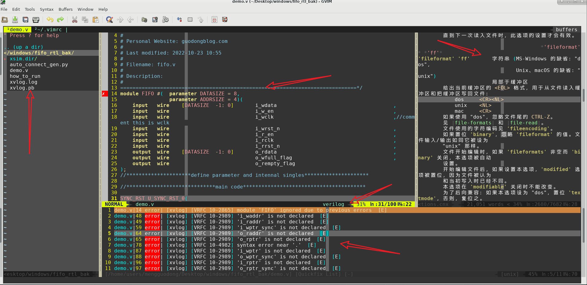
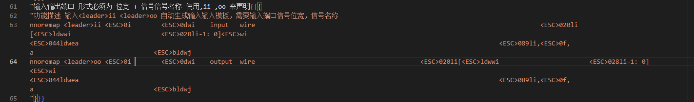
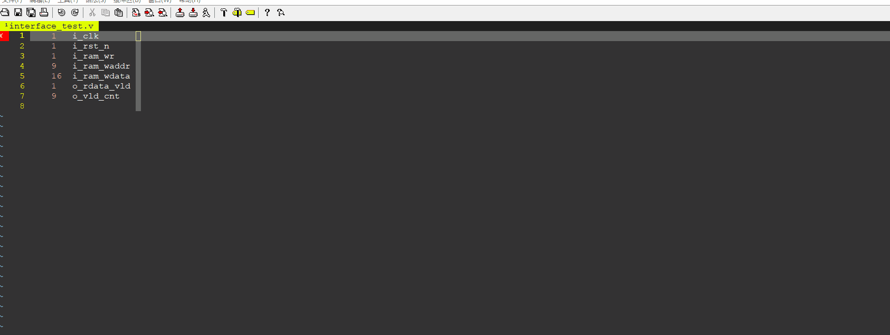
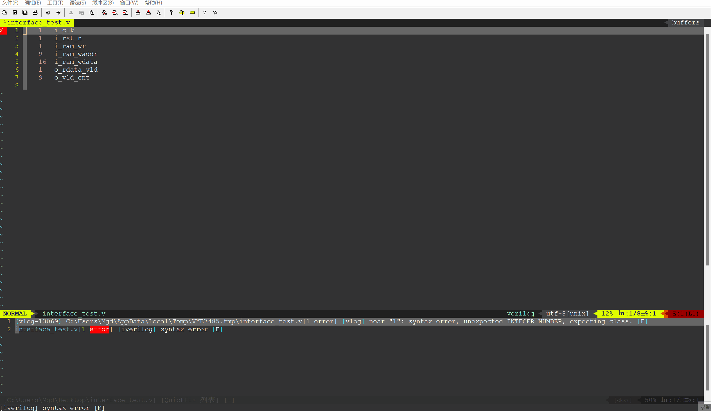
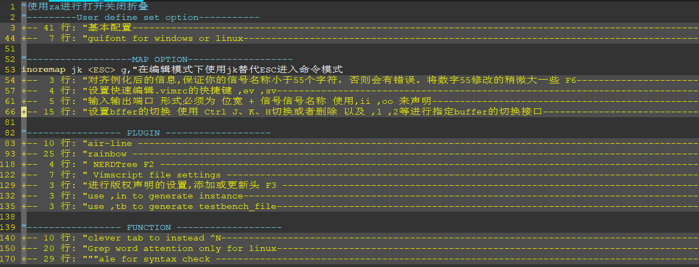

# GVim for Verilog

一套面向 Verilog 日常开发的 Vim/GVim 配置。项目把常用配置和插件直接放在仓库中，安装后即可获得文件树、状态栏、括号补全、端口生成、模块实例化和 `xvlog` 语法检查等功能。

本项目优先考虑简单、离线可用和容易修改。你可以直接使用完整配置，也可以只挑选需要的映射、函数或插件。



## 主要功能

- Verilog 语法高亮和常用编辑选项
- NERDTree 文件树与 Airline 状态栏
- 自动补全括号和彩虹括号
- 快速生成 `input`、`output` 端口声明
- 添加或更新文件头、模块名和修改时间
- 生成模块实例化模板和 testbench 骨架
- 使用 ALE 调用 Vivado `xvlog` 进行语法检查
- Buffer 快速切换、关闭以及跨文件搜索
- 可选的 Vim 中文帮助文档

## 使用前须知

建议使用 Vim/GVim 8.2 或更高版本。开始安装前，请注意以下依赖和配置行为：

- 语法检查依赖外部 Verilog 工具；仓库示例使用 Vivado `xvlog`，不同电脑可以自行选择。详见 [ALE 使用指南](docs/ale.md)。
- `,in` 和 `,tb` 是项目自行编写的生成脚本，当前使用 Vim 的旧式 `:python` 接口。环境要求、用法和限制详见 [自定义生成脚本说明](docs/custom-generators.md)。
- 当前 `.vimrc` 禁用了 swap、backup 和持久化 undo 文件。请先保存或备份自己的原配置，再决定是否保留这些选项。
- 窗口大小和字体使用了预设值，不适合当前屏幕时可在 `.vimrc` 中修改 `lines`、`columns` 和 `guifont`。
- 本仓库已附带插件，不需要额外安装插件管理器。

## 快速安装

安装的核心只有两部分：合并 `.vimrc`，然后把仓库中的 `pack` 目录放到 Vim 的 package 路径下。

### Linux

1. 备份已有的 `~/.vimrc`。
2. 将仓库中的 `.vimrc` 内容合并到 `~/.vimrc`；没有个人配置时也可以直接复制。
3. 将仓库中的整个 `pack` 目录复制到 `~/.vim/`。

安装后的 ALE 入口应位于：

```text
~/.vim/pack/ale/start/ale/plugin/ale.vim
```

### Windows

1. 在 GVim 中执行 `:echo $HOME`，确认用户目录。
2. 备份已有的 `_vimrc`，再将仓库中的 `.vimrc` 内容合并进去。常见位置是 `%USERPROFILE%\_vimrc`。
3. 将仓库中的整个 `pack` 目录复制到 `%USERPROFILE%\vimfiles\`。

安装后的 ALE 入口通常位于：

```text
%USERPROFILE%\vimfiles\pack\ale\start\ale\plugin\ale.vim
```

如果使用的是 GVim 安装目录中的 `vimfiles`，可以执行 `:echo &packpath` 查看 Vim 实际搜索的 package 路径。选择其中一个路径安装即可，不必在多个位置重复复制。

## 安装验证

重新启动 Vim/GVim，然后依次执行：

```vim
:echo v:version
:echo exists(':NERDTreeToggle')
:echo exists(':ALEInfo')
:echo executable('xvlog')
```

- 两个 `exists()` 返回 `2`，表示 NERDTree 和 ALE 已加载。
- `executable('xvlog')` 返回 `1`，表示 ALE 可以找到 Vivado 的 `xvlog`。
- 执行 `:ALEInfo` 可以查看当前文件使用的 linter 和完整诊断信息。

使用 Python 版实例化和 testbench 生成功能前，还可以执行：

```vim
:echo has('python')
```

返回 `1` 才表示当前 Vim 支持 `,in` 和 `,tb` 所需的接口。

## 快捷键速查

默认 `<leader>` 是英文逗号 `,`。

| 快捷键 | 模式 | 功能 |
| --- | --- | --- |
| `jk` | 插入模式 | 退出插入模式，并向右补偿光标位置 |
| `F2` | 普通模式 | 打开或关闭 NERDTree 文件树 |
| `F3` | 普通模式 | 添加文件头；已有文件头时更新文件名和修改时间 |
| `F6` | 普通模式 | 对齐实例化端口，默认要求信号名短于 55 个字符 |
| `,ev` | 普通模式 | 分屏打开当前 Vim 配置 |
| `,sv` | 普通模式 | 重新加载当前 Vim 配置 |
| `,ii` | 普通模式 | 根据“位宽 信号名”生成 `input wire` 声明 |
| `,oo` | 普通模式 | 根据“位宽 信号名”生成 `output wire` 声明 |
| `,in` | 普通模式 | 使用 Python 脚本生成模块实例化模板 |
| `,tb` | 普通模式 | 使用 Python 脚本生成 testbench 骨架 |
| `,ig` | 普通模式 | 使用 `vlog_inst_gen` 插件生成实例化模板 |
| `,im` | 普通模式 | 切换 `vlog_inst_gen` 的输出模式 |
| `Ctrl-j` | 普通模式 | 切换到下一个 Buffer |
| `Ctrl-k` | 普通模式 | 切换到上一个 Buffer |
| `Ctrl-h` | 普通模式 | 关闭当前 Buffer |
| `,g` + 动作/选择 | 普通/可视模式 | 在当前目录递归搜索选中的单词，仅 Linux 启用 |

Vim 配置文件使用 marker 折叠。在带有 `{{{` 标记的配置段上按 `za`，可以展开或收起该段。

## 功能演示

### 快速生成端口声明

准备一行“位宽 信号名”形式的文本，例如：

```text
8 data_i
```

将光标放在该行，按 `,ii` 或 `,oo`，即可生成对应的输入或输出端口声明。





结合 Vim 宏可以一次处理多行端口：



如果位宽为 1，生成结果中可能出现 `[1      -1: 0]`。可以使用下面的替换命令将其替换为空白：

```vim
:%s/\[1      -1: 0\]/              /g
```

### 文件头和模块骨架

在新文件中按 `F3`，会添加作者、文件名、修改时间、模块名和基础代码分区。再次按 `F3` 时，只更新文件名和修改时间。

模块名默认取当前文件名，并转换为大写。需要不同命名规则时，可以修改 `pack/user_define/start/user_define/plugin/addtitle.vim`。

### 模块实例化

项目提供两套实例化方式：

- `,in`：自定义 Python 实现，在新标签页中生成实例化内容。
- `,ig`：`vlog_inst_gen` 的 Vimscript 实现，不依赖 Vim 的 Python 接口；使用 `,im` 可以切换复制、分屏显示或更新文件等输出模式。

脚本主要面向 Verilog-2001 风格的模块端口。复杂宏、特殊参数表达式或一个文件内存在多个模块时，请生成后检查结果。

`,in`、`,tb` 的输入格式、生成内容和后续优化计划见 [自定义实例化与 Testbench 生成脚本](docs/custom-generators.md)。

### 编辑界面

`F2` 控制文件树，Airline 在顶部显示 Buffer，并在底部显示状态信息。自动括号和 Rainbow 用不同颜色展示嵌套括号。



## 内置插件

| 目录 | 用途 |
| --- | --- |
| `pack/ale/start/ale` | 异步语法检查，当前配置使用 `xvlog` |
| `pack/NERD_tree/start/NERD_tree` | 文件树 |
| `pack/vim_airline_master/start` | 状态栏、Buffer 标签及主题 |
| `pack/auto_pairs_master/start/auto_pairs_master` | 括号自动补全 |
| `pack/rainbow/start/rain_bow` | 彩虹括号 |
| `pack/user_define/start/user_define` | 文件头、实例化和 testbench 等自定义功能 |
| `pack/vlog_inst_gen/start/vlog_inst_gen` | Vimscript 版 Verilog 实例化工具 |
| `pack/vimcdoc/opt/vimcdoc` | 可选的 Vim 中文帮助 |

`vimcdoc` 位于 `opt` 目录，不会自动加载。需要中文帮助时执行：

```vim
:packadd vimcdoc
```

## 使用教程

- [ALE 与 Verilog 检查器使用指南](docs/ale.md)：说明不同检查器环境、Buffer/全局作用域、常用命令和排查步骤。
- [自定义实例化与 Testbench 生成脚本](docs/custom-generators.md)：说明 `,in`、`,tb` 的运行环境、输入格式、当前限制和后续优化方向。

## 常见问题

### ALE 没有显示诊断

先执行 `:echo exists(':ALEInfo')`。如果返回 `0`，请检查 `pack/ale/start/ale` 的目录层级；如果 ALE 已加载，再执行 `:ALEInfo` 和 `:echo executable('xvlog')` 检查 Vivado 环境。完整步骤见 [ALE 使用指南](docs/ale.md)。

### 执行 `,in` 或 `,tb` 提示 Python 错误

执行 `:echo has('python')`。返回 `0` 表示当前 Vim 没有旧式 Python 接口，可以改用 `,ig`。脚本现状和迁移计划见 [自定义生成脚本说明](docs/custom-generators.md)。

### 出现 `^M` 或换行符错误

通常是 Windows 与 Linux 换行格式混用导致。打开对应文件后执行：

```vim
:set fileformat=unix
:write
```

如果行尾的 `^M` 已经成为文件内容，可先执行 `:%s/\r$//` 再保存。

### 窗口或字体不合适

在 `.vimrc` 中搜索 `lines`、`columns` 和 `guifont`，按自己的显示器、系统字体和缩放比例修改。

### 不希望禁用备份文件

删除或注释 `.vimrc` 中的 `set noundofile`、`set nobackup` 和 `set noswapfile`，再根据自己的习惯配置 undo、backup 和 swap 目录。

## 插件来源与致谢

- [ALE](https://github.com/dense-analysis/ale)
- [NERDTree](https://www.vim.org/scripts/script.php?script_id=1658)
- [vim-airline](https://github.com/vim-airline/vim-airline)
- [auto-pairs](https://github.com/jiangmiao/auto-pairs)
- [rainbow](https://github.com/luochen1990/rainbow)
- [vimcdoc](https://github.com/yianwillis/vimcdoc)
- [vlog_inst_gen](https://www.vim.org/scripts/script.php?script_id=4151)

各插件的版权和许可信息以对应插件目录中的说明为准。

## 交流与贡献

欢迎提交 Issue 或 Pull Request。也可以通过邮箱 `823300630@qq.com` 联系作者。

个人网站：<https://tyxiumud.github.io/>
